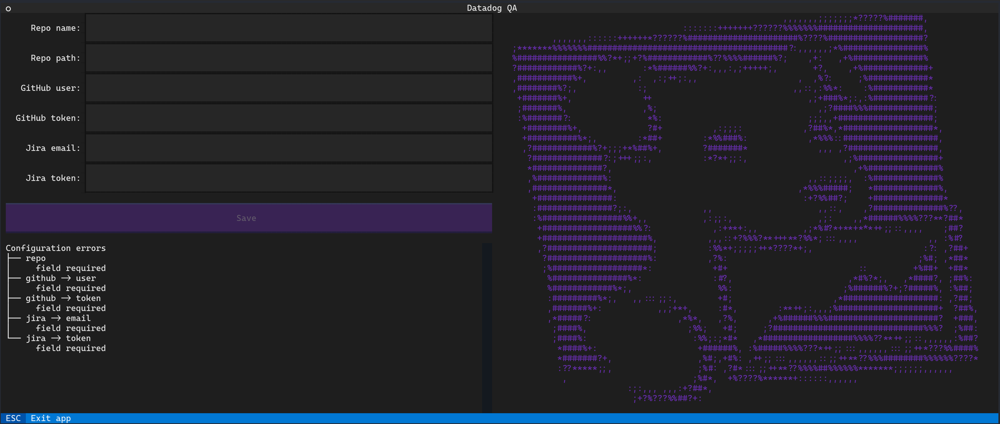

# Datadog QA

-----

DDQA is a tool for users of [Jira](https://www.atlassian.com/software/jira) to perform QA of anticipated releases of code on GitHub.

**Table of Contents**

- [Installation](#installation)
- [Overview](#overview)
- [Repository configuration](#repository-configuration)
  - [Common](#common)
  - [Teams](#teams)
- [User configuration](#user-configuration)
  - [GitHub auth](#github-auth)
  - [Jira auth](#jira-auth)
- [License](#license)

## Installation

```
pip install ddqa
```

## Overview

DDQA works by finding test candidates between two Git references and translates each pull request or direct commit into a Jira issue per designated GitHub team, assigned to a randomly chosen member of that team. The configured statuses, for example `TODO` or `Done`, correspond to (lowercased) labels prefixed with `ddqa-` that the tool will track.

## Repository configuration

A repository must be configured before use:

```toml
global_config_source = "..."
jira_statuses = ["..."]

[teams."..."]
jira_project = "..."
jira_issue_type = "..."
github_team = "..."
```

### Common

- `global_config_source` (***required***) - This is a URL (optionally encoded in [Base64](https://en.wikipedia.org/wiki/Base64)) like `https://raw.githubusercontent.com/org/repo/master/jira.toml` that points to the raw contents of a TOML file on GitHub that contains potentially private metadata that the tool needs in order to operate. Currently, the only required information is the cloud URL and a mapping of GitHub usernames to Jira IDs:
  ```toml
  jira_server = "https://<ORG>.atlassian.net"

  [members]
  github-user1 = "jira-id1"
  ```
- `jira_statuses` (***required***) - The entries and order of this list correspond to the desired QA workflow, for example:
  ```toml
  jira_statuses = [
    "TODO",
    "Testing",
    "Done",
  ]
  ```
- `ignored_labels` - Any pull requests labeled with any of the entries will not be assigned by default:
  ```toml
  ignored_labels = [
    "changelog/no-changelog",
  ]
  ```

### Teams

Each team must be configured. The name of each team is arbitrary but should be the human readable version or a nickname. The order of teams is also arbitrary but would benefit from being ordered by teams that commit/would be assigned most frequently as manual selection would potentially require less scrolling.

- `jira_project` (***required***) - This is the team's Jira project in which issues will be created. If there exists an issue `FOO-123`, the project name is `FOO`.
- `jira_issue_type` (***required***) - This is the type of Jira issue that will be created and will most often be `Task`. The issue type can be found as the `fields.issuetype.name` returned value in the payload from `/rest/api/2/issue/<ISSUE>`.
- `github_team` (***required***) - This is the team's GitHub name, excluding the organization `org/` prefix
- `github_labels` - This team will be assigned by default to any pull requests that are labeled with any of the entries (as long as the pull request has no labels that match any of those defined in the top-level `ignored_labels` option)

## User configuration

DDQA will always ensure valid config by loading the configuration screen if there are errors or missing required fields.



### GitHub auth

You'll need to create a [personal access token (classic)](https://docs.github.com/en/authentication/keeping-your-account-and-data-secure/creating-a-personal-access-token#personal-access-tokens-classic) with `public_repo` and `read:org` permissions and, if required by the organization, [enable SAML single sign-on](https://docs.github.com/en/enterprise-cloud@latest/authentication/authenticating-with-saml-single-sign-on/authorizing-a-personal-access-token-for-use-with-saml-single-sign-on).

### Jira auth

You'll need to create an [API token](https://support.atlassian.com/atlassian-account/docs/manage-api-tokens-for-your-atlassian-account/).

## License

`ddqa` is distributed under the terms of the [MIT](https://spdx.org/licenses/MIT.html) license.
