# Create items

-----

```text
Usage: ddqa create [OPTIONS] PREVIOUS_REF CURRENT_REF

  Create QA items.

Options:
  -l, --label TEXT  Labels that will be attached to created issues  [required]
```

As an example, to create items for a hypothetical `7.44.0` release where the previous release was a patch, you might do:

```
ddqa create 7.43.1 7.44.0 -l 7.44.0-qa -l 7.44.0-rc.1
```

<figure markdown>
  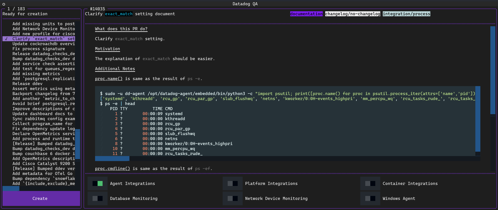{ loading=lazy role="img" }
</figure>

## Queue

This section tells you how many PRs or direct commits are queued up for assignment. This will also display the status of API retries due to rate limits.

<figure markdown>
  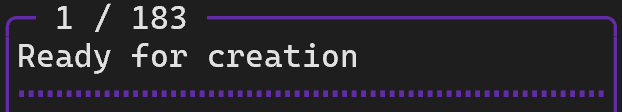{ loading=lazy role="img" }
</figure>

## Candidates

This section displays the list of candidates for assignment. Clicking will render data about the candidate in the right panel.

<figure markdown>
  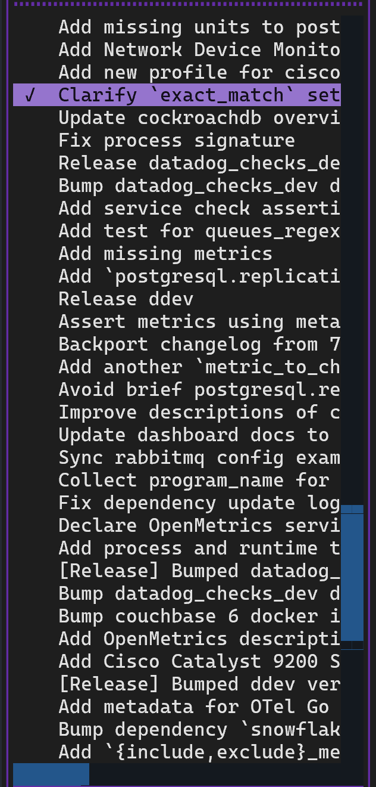{ loading=lazy width="300" role="img" }
</figure>

### Title

This section displays a short description about the candidate, using the title for PRs and Git metadata for direct commits.

You may ++ctrl+left-button++ the identifier on top to navigate to the candidate in your preferred web browser.

<figure markdown>
  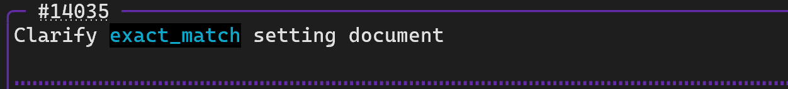{ loading=lazy role="img" }
</figure>

### PR labels

If the candidate is a PR then its labels will render here.

<figure markdown>
  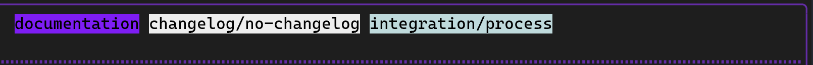{ loading=lazy role="img" }
</figure>

### Description

This section displays detailed information about the candidate, using the PR body or Git metadata for direct commits.

<figure markdown>
  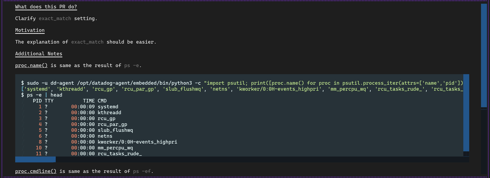{ loading=lazy role="img" }
</figure>

### Pending assignments

This section displays a toggle for each team determining whether they should be assigned to the candidate. The default state of each team's toggle will be enabled if any of the candidate's PR labels match the team's [defined labels](../config/repo.md#github-labels).

<figure markdown>
  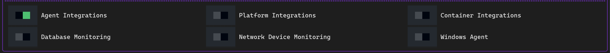{ loading=lazy role="img" }
</figure>

## Creation

When you are satisfied with the pending candidate assignments, you may click the button to begin the process of Jira issue creation.

<figure markdown>
  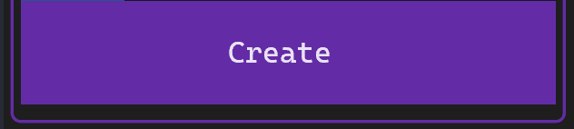{ loading=lazy width="400" role="img" }
</figure>

!!! tip
    It is likely that your Jira profile is set up to automatically watch issues that you create, including those via the API. If you would like to disable this temporarily so you don't get notifications for everything, you may do the following:

    1. Go to your profile settings page on the Jira instance `https://<ORG>.atlassian.net/secure/ViewPersonalSettings.jspa`
    2. Change the `Watch your issues` option to `Disabled`

### Progress

The [queue section](#queue) will transition to showing you the progress of QA item creation.

<figure markdown>
  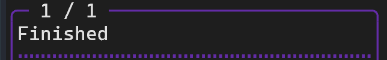{ loading=lazy role="img" }
</figure>

### Items

The [candidate listing](#candidates) will be reduced to just those that have been assigned. The number on the left refers to the number of teams that have had an issue created for that candidate.

<figure markdown>
  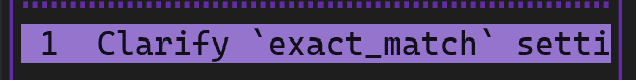{ loading=lazy role="img" }
</figure>

### Results

The [assignments section](#pending-assignments) will now display the created issue for each team. You may ++ctrl+left-button++ the assigned team member or Jira issue to open in your preferred web browser.

<figure markdown>
  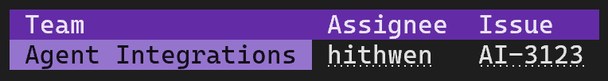{ loading=lazy role="img" }
</figure>

!!! note
    When each candidate is assigned, the priority is based on whoever has been assigned the least amount of items, followed by whoever did not review the candidate (if it is a PR). Assuming that when an assignment is about to happen and everyone on the team has the same number of assigned items and everyone reviewed (or did not) the candidate, then the result is completely random.

You may exit by pressing ++ctrl+c++ or the button.

<figure markdown>
  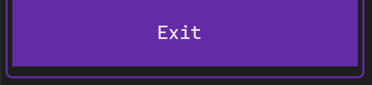{ loading=lazy width="400" role="img" }
</figure>
