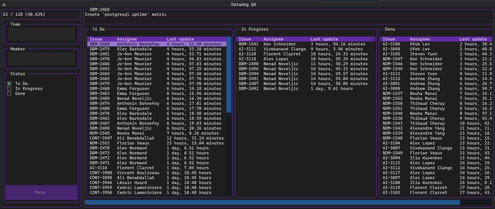
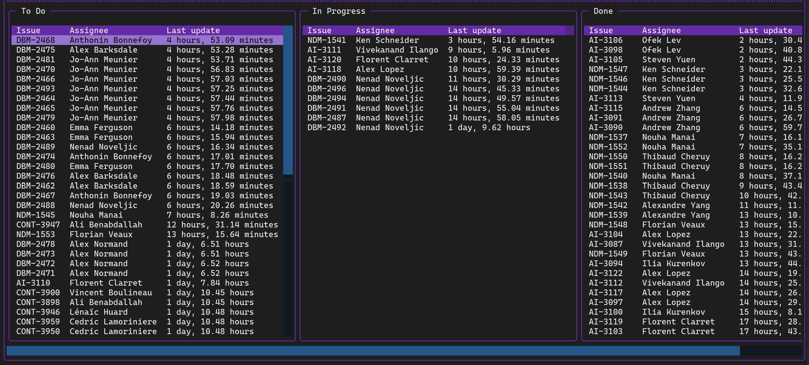
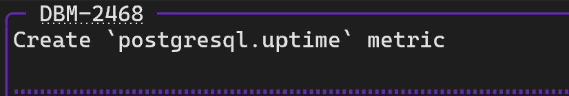
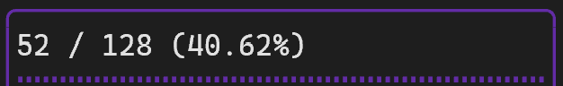
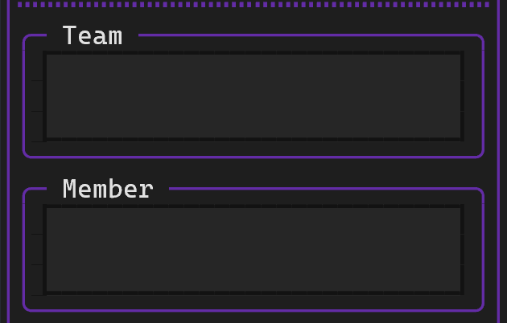
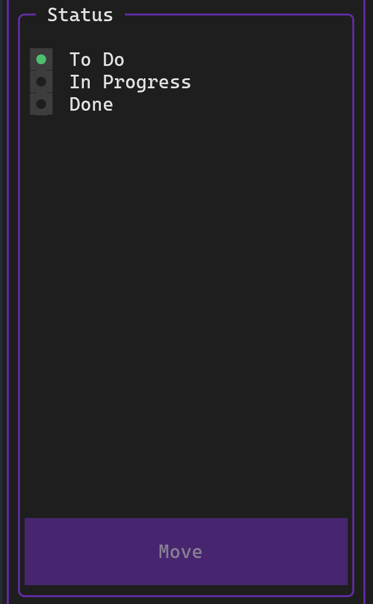

# View dashboard

-----

```text
Usage: ddqa status [OPTIONS] LABELS...

  Display the QA dashboard.

Options:
  -h, --help  Show this message and exit.
```

As an example, if you want to check the status of any issue that is labeled with either `7.44.0-rc.1` or `7.44.0-rc.2`, you would do:

```
ddqa status 7.44.0-rc.1 7.44.0-rc.2
```

<figure markdown>
  { loading=lazy role="img" }
</figure>

## Issues

This section displays the status of all issues, or a subset of issues if a [filter](#filters) is active.

<figure markdown>
  { loading=lazy role="img" }
</figure>

## Metadata

This section displays a short description about what the currently highlighted [issue](#issues) is testing, using the title for PRs and Git metadata for direct commits.

You may ++ctrl+left-button++ the identifier on top to navigate to the issue in your preferred web browser.

<figure markdown>
  { loading=lazy role="img" }
</figure>

## Progress

This section displays the completion progress of all issues, or a subset of issues if a [filter](#filters) is active.

<figure markdown>
  { loading=lazy role="img" }
</figure>

!!! note
    An issue is considered complete when its [status](../config/repo.md#jira-statuses) corresponds to the last entry in the configured list of [QA statuses](../config/repo.md#qa-statuses).

## Filters

This section contains mutually exclusive filters that may be used to limit the tracked issues to a subset. To clear a filter, remove the text and press ++enter++.

<figure markdown>
  { loading=lazy width="400" }
</figure>

!!! note
    If the auto-completion options are missing something you might expect, it means there are no issues that correspond to that item.

## QA status

This section displays the QA status of the currently highlighted [issue](#issues). When the issue belongs to you, the `Move` button will be enabled.

<figure markdown>
  { loading=lazy width="300" }
</figure>
