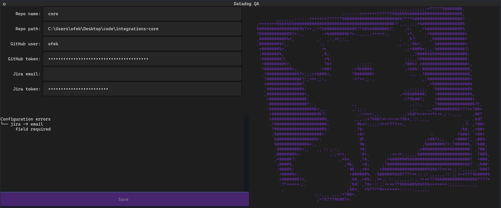
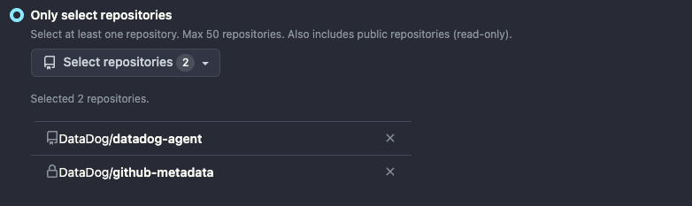
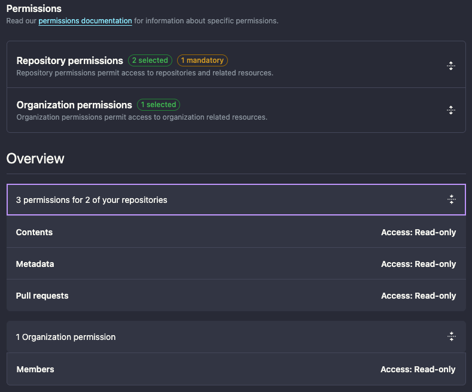

# User configuration

-----

DDQA will always ensure valid config by loading the configuration screen if there are errors or missing required fields.

<figure markdown>
  { loading=lazy role="img" }
</figure>

!!! tip
    To locate your personal config file you may run: `ddqa config find`

## GitHub auth

You'll need to create a [fine-grain access token](https://docs.github.com/en/authentication/keeping-your-account-and-data-secure/creating-a-personal-access-token#personal-access-tokens-classic) using `DataDog` resource owner.

Restrict its access to the concerned repositories:
- `DataDog/github-metadata`, to access user mapping.
- the list of repositories you are creating cards for (e.g. `DataDog/datadog-agent`) 

<figure markdown>
  { loading=lazy role="img" }
</figure>

Set the required permissions:
- `Content: read-only` and `Pull requests: read-only` repository permissions.
- `Members: read-only` organization permission.

<figure markdown>
  { loading=lazy role="img" }
</figure>

The following APIs are used:

- `/search/issues` ([GET](https://docs.github.com/en/rest/search?apiVersion=2022-11-28#search-issues-and-pull-requests))
- `/repos/{owner}/{repo}/pulls/{pull_number}/reviews` ([GET](https://docs.github.com/en/rest/pulls/reviews?apiVersion=2022-11-28#list-reviews-for-a-pull-request))
- `/orgs/{org}/teams/{team_slug}/members` ([GET](https://docs.github.com/en/rest/teams/members?apiVersion=2022-11-28#list-team-members))

    ??? note
        This endpoint is [not yet supported](https://docs.github.com/en/rest/overview/endpoints-available-for-fine-grained-personal-access-tokens?apiVersion=2022-11-28) when using fine-grained personal access tokens.

!!! tip
    You can configure your GitHub credentials using the `DDQA_GITHUB_USER` and `DDQA_GITHUB_TOKEN` environment variables.

## Jira auth

You'll need to create an [API token](https://support.atlassian.com/atlassian-account/docs/manage-api-tokens-for-your-atlassian-account/) with the appropriate scopes.

The following APIs are used:

- `/rest/api/2/issue` ([POST](https://developer.atlassian.com/cloud/jira/platform/rest/v2/api-group-issues/#api-rest-api-2-issue-post))
- `/rest/api/2/myself` ([GET](https://developer.atlassian.com/cloud/jira/platform/rest/v2/api-group-myself/#api-rest-api-2-myself-get))
- `/rest/api/2/search` ([POST](https://developer.atlassian.com/cloud/jira/platform/rest/v2/api-group-issue-search/#api-rest-api-2-search-post))
- `/rest/api/2/issue/{issueIdOrKey}/transitions` ([GET](https://developer.atlassian.com/cloud/jira/platform/rest/v2/api-group-issues/#api-rest-api-2-issue-issueidorkey-transitions-get), [POST](https://developer.atlassian.com/cloud/jira/platform/rest/v2/api-group-issues/#api-rest-api-2-issue-issueidorkey-transitions-post))

!!! tip
    You can configure your Jira credentials using the `DDQA_JIRA_EMAIL` and `DDQA_JIRA_TOKEN` environment variables.
