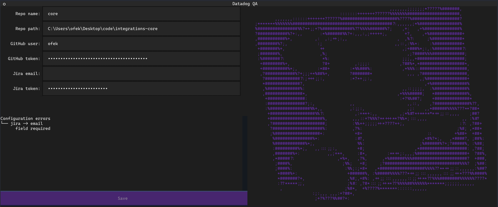
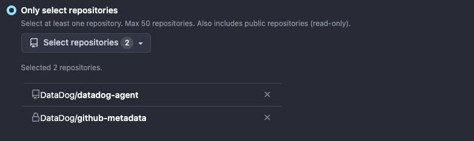
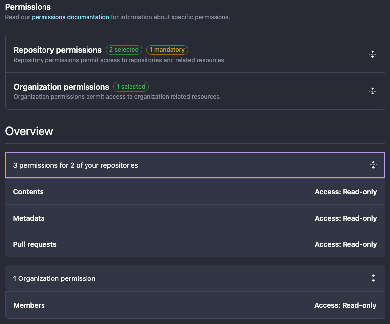

# User configuration

-----

DDQA will always ensure valid config by loading the configuration screen if there are errors or missing required fields.

<figure markdown>
  { loading=lazy role="img" }
</figure>

!!! tip
    To locate your personal config file you may run: `ddqa config find`

## GitHub auth

You'll need to create a [fine-grain access token](https://docs.github.com/en/authentication/keeping-your-account-and-data-secure/creating-a-personal-access-token#personal-access-tokens-classic) using `DataDog` resource owner.

Restrict its access to the list of repositories you are creating cards for (e.g. `DataDog/datadog-agent`).

<figure markdown>
  { loading=lazy role="img" }
</figure>

Set the required permissions:
- `Content: read-only` and `Pull requests: read-only` repository permissions.
- `Members: read-only` organization permission.

<figure markdown>
  { loading=lazy role="img" }
</figure>

The following APIs are used:

- `/search/issues` ([GET](https://docs.github.com/en/rest/search?apiVersion=2022-11-28#search-issues-and-pull-requests))
- `/repos/{owner}/{repo}/pulls/{pull_number}/reviews` ([GET](https://docs.github.com/en/rest/pulls/reviews?apiVersion=2022-11-28#list-reviews-for-a-pull-request))
- `/orgs/{org}/teams/{team_slug}/members` ([GET](https://docs.github.com/en/rest/teams/members?apiVersion=2022-11-28#list-team-members))

    ??? note
        This endpoint is [not yet supported](https://docs.github.com/en/rest/overview/endpoints-available-for-fine-grained-personal-access-tokens?apiVersion=2022-11-28) when using fine-grained personal access tokens.

!!! tip
    You can configure your GitHub credentials using the `DDQA_GITHUB_USER` and `DDQA_GITHUB_TOKEN` environment variables.

## Jira auth

You'll need to create an [API token](https://support.atlassian.com/atlassian-account/docs/manage-api-tokens-for-your-atlassian-account/) with the appropriate scopes.

The following APIs are used:

- `/rest/api/2/issue` ([POST](https://developer.atlassian.com/cloud/jira/platform/rest/v2/api-group-issues/#api-rest-api-2-issue-post))
- `/rest/api/2/myself` ([GET](https://developer.atlassian.com/cloud/jira/platform/rest/v2/api-group-myself/#api-rest-api-2-myself-get))
- `/rest/api/2/search` ([POST](https://developer.atlassian.com/cloud/jira/platform/rest/v2/api-group-issue-search/#api-rest-api-2-search-post))
- `/rest/api/2/issue/{issueIdOrKey}/transitions` ([GET](https://developer.atlassian.com/cloud/jira/platform/rest/v2/api-group-issues/#api-rest-api-2-issue-issueidorkey-transitions-get), [POST](https://developer.atlassian.com/cloud/jira/platform/rest/v2/api-group-issues/#api-rest-api-2-issue-issueidorkey-transitions-post))
- `/rest/api/2/user/bulk` ([GET](https://developer.atlassian.com/cloud/jira/platform/rest/v2/api-group-users/#api-rest-api-2-user-bulk-get))

### Example: JIRA API token Scopes (14 Nov 2025)
```
Write
  write:issue:jira
  write:issue.property:jira
  write:comment:jira
  write:comment.property:jira
  write:attachment:jira
Read
  read:issue.transition:jira
  read:status:jira
  read:field-configuration:jira
  read:issue-details:jira
  read:field.default-value:jira
  read:field.option:jira
  read:field:jira
  read:group:jira
  read:application-role:jira
  read:user:jira
  read:avatar:jira
  read:issue:jira
  read:issue:jira-software
```


!!! tip
    You can configure your Jira credentials using the `DDQA_JIRA_EMAIL` and `DDQA_JIRA_TOKEN` environment variables.

## Datadog auth

The mapping of GitHub usernames to Jira account IDs is stored in a Datadog [Actions Datastore](https://docs.datadoghq.com/actions/datastores/) rather than in a GitHub repository, so `ddqa` needs a Datadog API key and application key with access to it.

The following API is used:

- `/api/v2/actions-datastores/{datastore_id}` ([GET](https://docs.datadoghq.com/api/latest/actions-datastores/))
- `/api/v2/actions-datastores/{datastore_id}/items` ([GET](https://docs.datadoghq.com/api/latest/actions-datastores/))

### Recommended: ephemeral credentials via `dd-auth`

The `[datadog]` config table is **not required**. The recommended way to authenticate is to mint short-lived credentials with [`dd-auth`](https://github.com/DataDog/dd-auth) and run `ddqa` as its subcommand, so no Datadog secret is ever written to disk. Since `dd-auth` exports `DD_API_KEY`/`DD_APP_KEY` by default, rename them to the variables `ddqa` reads:

```shell
dd-auth --actions-api --api-key-env DDQA_DATADOG_API_KEY --app-key-env DDQA_DATADOG_APP_KEY -- ddqa sync
```

### Alternative: persistent credentials

If you'd rather not run `dd-auth` every time, you can create a long-lived API key and application key under [Organization Settings](https://app.datadoghq.com/organization-settings/api-keys) and store them either as environment variables:

```shell
export DDQA_DATADOG_API_KEY="..."
export DDQA_DATADOG_APP_KEY="..."
```

or persistently in your personal config file's `[datadog]` table (via the configuration screen, or `ddqa config set datadog.api_key ...`).
